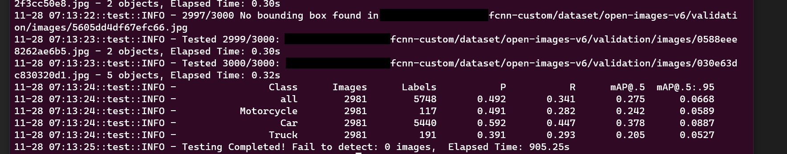
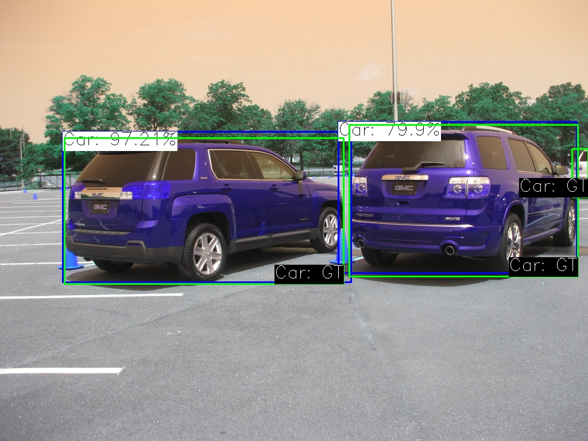

# Custom Faster-CNN
Custom Faster-CNN implementation based on Tensorflow. Adapted from [you359/KerasFasterRCNN](https://github.com/you359/Keras-FasterRCNN/tree/eb67ad5d946581344f614faa1e3ee7902f429ce3). Metrics as well as functionality of this project are reference from [Yolov7](https://github.com/WongKinYiu/yolov7).

## Installation
Install required packages
- numpy
- matplotlib
- pandas
- tensorflow
- tqdm
- opencv-python
- fiftyone
- pydot
- ipython
- seaborn
```sh
pip install -r requirements.txt
```

## Datasets
### Download
We use the `fiftyone` api to download the datasets needed for object detection. <br>
Check `utilis/dataset.py` for detailed implementation of the codes.

- 10k training data
    ```sh
    python utilis/dataset.py --download --dataset open-images-v6 --classes Motorcycle Car Truck --splits train --max-samples 10000 --save-dir ./dataset
    ```
- 3k validation and testing data
    ```sh
    python utilis/dataset.py --download --dataset open-images-v6 --classes Motorcycle Car Truck --splits validation test --max-samples 3000 --save-dir ./dataset
    ```

### Preprocess
Label files (annotations) will be created and will be used to reference to the input images.

Format of the annotation files is as follows (sample):
``` 
    [
        {
        "image": <absolute path to the image>,
        "classes": [<classes>],
        "bbox": [
            [<image_id>, abs_x1, abs_y1, abs_x1, abs_y2, class],
            ["000b14e4ee4a2b2b", 70.78340608, 132.09815866, 955.57605376, 627.4662651699999, "Truck"]
        }
    ]
```
Check `utilis/dataset.py` for detailed implementation of the codes.

- Preprocess to suitable format for training.
    ```sh
    python utilis/dataset.py --process --dataset open-images-v6 --classes Motorcycle Car Truck --save-dir ./dataset --model fcnn-custom
    ```

## Training
Training configuration file: `config/config.py`

Important configuration:

- classes
- anchor_box_sizes
- backbone (Currently only vgg16 and vgg19)
- IM_SIZE (fixed input size of IM_SIZE x IM_SIZE)
- train_file (annotation file as per preprocess)
- num_epochs
- epoch_length (aka batch size, to evaluate model losses at every epoch_length)

```sh
# Device: -1 (CPU), 0-4 (GPUs)
python train.py --name exp1 --device -1 --epoch-length 1000 --num-epochs 300
```

After training, folders and file will be create as follows:
```sh
.
├── runs     
    └── train 
        └── exp1  
            ├── weights
            |   ├── best_epoch  # Contains optimizer and model weights
            |   ├── best_batch  # Contains optimizer and model weights
            |   └── last        # Contains optimizer and model weights
            ├── hyp.json
            ├── result.json
            └── train.log                     
```


## Testing
Arguments:
- save-txt: Include this if you want to save the predicted labels
- name: name of the testing instance
- weights: file path of the model weight
- annotations: file path of the preprocess annotated json file (check training above for the population of the file)
- hyp: configuration of the training instance saved at the training folder
- sample-rate: save images of predicted and ground-truth bounding boxes at indicated rate.
- conf-thres: Valid bounding boxes at above confidence level
- iou-thres: filter similar bounding boxes at indicated iou threshold using NMS (Non-max suppression)

```sh
# Device: -1 (CPU), 0-4 (GPUs)
python test.py --device -1 --save-txt --name exp1 --weights ./runs/train/exp1/model.h5 --annotations ./dataset/open-images-v6/validation_labels.json --hyp ./runs/train/exp1/hyp.json --sample-rate 10 --conf-thres 0.001 --iou-thres 0.65
```

After testing, folders and file will be create as follows:
```sh
.
├── runs     
    └── test 
        └── exp1  
            ├── sample
            |   └── images.jpg                  # testing images containing pred and GT bounding boxes
            ├── confusion_matrix_abs.png        # Confusion Matrix with absolute figure
            ├── confusion_matrix_normalize.png  # Confusion Matrix with percentage
            ├── F1_curve.png                    # F1
            ├── P_curve.png                     # Precision
            ├── PR_curve.png                    # Precision-recall
            ├── R_curve.png                     # Recall
            ├── plabels.json                    # Predicted bounding boxes
            └── test.log                        # log file
```

### Inference
Arguments:
- name: name of the testing instance
- weights: file path of the model weight
- hyp: configuration of the training instance saved at the training folder
- source: Can be video, image file or folders, txt file containing media file path
- conf-thres: Valid bounding boxes at above confidence level
- iou-thres: filter similar bounding boxes at indicated iou threshold using NMS (Non-max suppression)

```sh
# Device: -1 (CPU), 0-4 (GPUs)
python detect.py --device -1 --name exp1 --weights ./runs/train/exp1/model.h5 --hyp ./runs/train/exp1/hyp.json --source ./dataset/open-images-v6/test/images --conf-thres 0.001 --iou-thres 0.65
```

After inference, folders and file will be create as follows:
```sh
.
├── runs     
    └── detect 
        └── exp1  
            ├── video/images    # video or image files
            └── detect.log      # log file
```

## Codes Review
Detailed explaination of codes can be found in [codes.md](./codes.md)


## Demo Result
Works relative well on large bounding boxes. May need to configure and and change the loss function to cater to the smaller bounding boxes. 
- Training: do refer to the training log `static/train.log` for more details
- Epoch: 44
- fps: ~3 fps
- GPU: NVIDIA GeForce RTX 2080 (8GB)





## Useful Articles / Acknowledgements
- [Allocating GPU Memory](https://stackoverflow.com/questions/34199233/how-to-prevent-tensorflow-from-allocating-the-totality-of-a-gpu-memory)
- [Allocating GPU Memory - Official](https://www.tensorflow.org/guide/gpu#limiting_gpu_memory_growth)
- [Check GPU Memory](https://stackoverflow.com/questions/59567226/how-to-programmatically-determine-available-gpu-memory-with-tensorflow)
- [Disable tf logging](https://stackoverflow.com/questions/35911252/disable-tensorflow-debugging-information)
- [maP Explained](https://learnopencv.com/mean-average-precision-map-object-detection-model-evaluation-metric/)
- [Open Images Download](https://storage.googleapis.com/openimages/web/download.html)
- [Research Paper on Faster RCNN](https://arxiv.org/abs/1506.01497)
- [tqdm with custom logger](https://github.com/tqdm/tqdm/issues/313)
- [Yolov7](https://github.com/WongKinYiu/yolov7)
- [you359/KerasFasterRCNN](https://github.com/you359/Keras-FasterRCNN/tree/eb67ad5d946581344f614faa1e3ee7902f429ce3)
