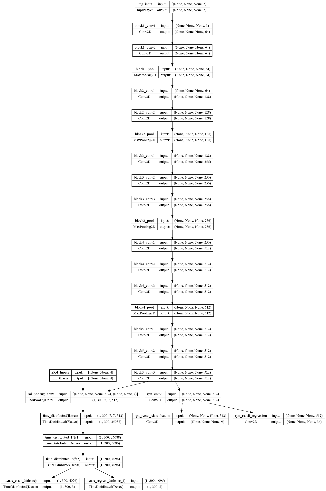

# Codes Explaination
This md file describes the functionalities of different code implementation in detail. 

## 1 Data preprocessing
## 1.1 Data preprocessing - raw dataset
We mainly used *open images* and *coco* dataset via the Fiftyone Api.
The open source tool, FiftyOne can be installed [here](https://storage.googleapis.com/openimages/web/download.html)

- Download *training dataset* from open images v6
```python
import fiftyone as fo
import fiftyone.zoo as foz

fo.config.dataset_zoo_dir = "./" # download dataset at current directory
dataset = fo.zoo.load_zoo_dataset(
              "open-images-v6",
              split="train",
              label_types=["detections"],
              classes=["Cat", "Dog"]
          )
```

- Transform annotation labels to the format as shown below
    - Keys: image - Imagefile (location - abs path) 
    - Keys: bbox - ['Imagefile', x1, y1, x2, y2, label]
        - coordinates are absolute positions to the image size
        - labels are not indexed-based.
    - Height and weight will be added during image augmentation

```
{'image': 'C://open-images-v6/train/data/0000b9fcba019d36.jpg', 
'bbox': [
    ['0000b9fcba019d36', 168.96, 206.079744, 925.44, 766.719744, 'Dog'],
    ['Imagefile', x1, y1, x2, y2, label]
]}
```

## 1.2 Data preprocessing - Data Generator
The main function to create a data generator for the inputs is `utilis/dataloader.data_generator`

0. Handle imbalanced data (Not implemented in code)
    - Resampling 
    - Stratify
1. Image Augmentation (`utilis/dataloader.augment`)
    - `C.augment`
        - 'horizontal_flip':True, 
        - 'vertical_flip': True, 
        - 'rotate': True
2. Resize Image (`utilis/dataloader.get_new_img_size`)
    - Ensure that the shortest side is `C.IM_SIZE` (Default is 600)
3. Get anchor boxes ground truth (`utilis/dataloader.get_achorb_gt`)
    - Configurations
        - `C.rpn_stride` - Downsampling magnitude through max-pooling layers depending on your architecture
        - `C.anchor_box_sizes` , `C.anchor_box_ratios` - anchor box dimension combinations to be considered
        - `C.num_anchors` - number of anchor_box combinations (dynamic)
        - `C.bbox_labels` - ["neg", "pos", "neutral"], determine by bbox iou (fixed)
        - `C.rpn_min_overlap_iou` , `C.rpn_max_overlap_iou` - Determine bbox's labels. (**neg <= min_iou < neutral < max_iou <= pos**)
    - Steps
        1. Initialize variables and output objectives: *(i - input, o - output)*
            - output_height, output_width - feature map size after pretrained model by dividing with rpn_stride 
            - y_rpn_overlap - Truthy value indicating overlapping *positive* region. **Shape: (o_height, o_width, num_anchors)**
            - y_is_box_valid - Truthy value indicating overlapping *positive and negative* regions. **Shape: (o_height, o_width, num_anchors)**  
            - y_rpn_regr - coordinate regression *(tx, ty, tw, th)* for improving overlapping *positive* region at each anchor. **Shape: (o_height, o_width, num_anchors * 4)** 
            - num_anchors_for_bbox - Number of overlapping *positive* region for each actual bounding boxes **Shape: (num_bbox, )**
            - best_iou_for_bbox - Best iou for each actual bounding box **Shape: (num_bbox, )**
            - best_anchor_for_bbox - Best anchor *(o_width, o_height, anchor_size_index, anchor_ratio_index)* for each actual bounding boxes **Shape: (num_bbox, 4)**
            - best_x_for_bbox - Best anchor coordinates *(i_x1, i_y1, i_x2, i_y2)* for each actual bounding boxes **Shape: (num_bbox, 4)**
            - best_dx_for_bbox - Best coordinate regression *(tx, ty, tw, th)* for each actual bounding boxes **Shape: (num_bbox, 4)**
            - gt_box - actual bounding box coordinates *(i_x1_true, i_y1_true, i_x2_true, i_y2_true)* relative to input size **Shape: (num_bbox, 4)**
        2. For every (output_height, output_width) aka pixel, **determine overlapping region and find best region for the actual bounding box**:
            - Treat each (pixel + 0.5) as the anchor centers and calculate anchor coordinates *(i_x1, i_y1, i_x2, i_y2)* relative to input size. Ignore coordinates that are out of image boundary.
            - For each anchor *(anchor_index)* and 
                - for each actual bounding boxes *(bbox_index)* in the image:
                    - initatlize bbox_type = "neg"
                    - calculate IOU (gt_box vs anchor)
                    - if current_iou > best_iou_for_bbox[bbox_index] 
                        - calculate coordinate regression *(tx, ty, tw, th)*
                        - Update best_anchor_for_bbox[bbox_index], best_iou_for_bbox[bbox_index], best_x_for_bbox[bbox_index,:], best_dx_for_bbox[bbox_index,:] 
                    - if current_iou >= rpn_max_overlap_iou
                        - calculate coordinate regression *(tx, ty, tw, th)*
                        - num_anchors_for_bbox[bbox_index] += 1
                        - start = 4 * (anchor_index)
                        - Update y_rpn_regr[o_height, o_width, start:start+4] = coordinate regression *(tx, ty, tw, th)*  for the highest current_iou in all the actual bounding boxes of an image. *(each coordinate pair can only correspond to one bounding box)*
                    - if rpn_min_overlap_iou < current_iou < rpn_max_overlap_iou and bbox_type != "pos":
                        - bbox_type = "neutral"
                - if bbox_type = "neg"
                    - y_is_box_valid[o_height, o_width, anchor_index] = 1 
                    - y_rpn_overlap[o_height, o_width, anchor_index] = 0
                - if bbox_type = "pos"
                    - y_is_box_valid[o_height, o_width, anchor_index] = 1 
                    - y_rpn_overlap[o_height, o_width, anchor_index] = 1
                - if bbox_type = "neutral"
                    - y_is_box_valid[o_height, o_width, anchor_index] = 0 
                    - y_rpn_overlap[o_height, o_width, anchor_index] = 0
        3. Ensure that every actual bounding boxes have **at least one positive RPN region**. (sum(num_anchors_for_bbox) >= len(num_anchors_for_bbox)) (Step 2 condition: current_iou >= rpn_max_overlap_iou) 
            - if num_anchors_for_bbox == 0: (no positive RPN region) (Take the best if don't have)
                - if best_anchor_for_bbox[idx, 0] == -1 (if there is no best anchor found)
                    - (Rectify) Smaller anchor (No anchor coincides with the actual bounding box)
                    - ignore and continue
                - y_is_box_valid, y_rpn_overlap = 1
                - Update y_rpn_regr = best_dx_for_bbox
4. Transform output (`utilis/dataloader.transform_output`)
    - Configurations
        - `C.num_regions` - number of rpn regions (Ground truth) to be considered for training
        - `C.preprocess_input_import` - Import preprocess module to transform img vector suited for imagenet
        - `C.img_scaling_factor` - does nothing. Default = 1
    - Transform Objective (`utilis/dataloader.transform_objective`)
        - Randomly sample `C.num_regions` (default 256) anchors in an image to have a ratio of 1:1
            - Pad with negative samples if number of positive samples < `C.num_regions`/2
            - **K.sum(y_is_box_valid) = 256**
        - y_rpn_cls
            - y_is_box_valid + y_rpn_overlap
            - shape: (1, num_anchor * 2, h, w)
        - y_rpn_regr
            - y_rpn_overlap x 4 + y_rpn_regr
            - scale y_rpn_regr *= 4
            - shape: (1, num_anchor * 4 * 2, h, w)
    - Transform Img vector (`utilis/dataloader.transform_image_vector`)
        - Resize to shorter length: 600
        - Image preprocess to imagenet
        - increase dim
5. Yield
    1. img : (1, i_h, i_w, c)
    2. [y_rpn_cls, y_rpn_regr] : [ (1, o_h, o_w, anchor * 2) , (1, o_h, o_w, anchor * 4 * 2)) ]
    3. img_data_aug **(bbox not resized yet)**

## 2 Models
## 2.1 Backbone
Backbone of this custom faster-rcnn include
- VGG19
- VGG16

Do remember to modify the `rpn_stride` configuration if you are adding new backbone

## 2.2 Sample architecture (VGG16)
Faster-RCNN consists of 2 models - RPN model and detector model. Below image is the overall architecture of how Faster-rcnn works:



## 2.3 Simple Walkthough
Both the RPN model and the detector model share a common backbone to retrieve the feature maps. During training, we will be training the RPN model and the detector model separately. Since the input of the detector model rely heavily on the results of the RPN model, the backbone will be trained on both models to speed up the training process.

However, during testing/inference, the detector model will **no longer** need to pass through the backbone again. Instead, the feature maps will be retrieved from the output of the RPN model. 

## 3. Training (Brief)
1. Load Data via Dataloader from part 1 and load the required models from part 2
2. For each image, get the probabilities (whether there is an object) and regression coordinates from the RPN model.
3. From the output of (2), get the ROIs and limit the number by applying NMS (Non-max suppression)
4. Process the ROIs by using the ground-truth from (1). (Figure out which class label is best represented in the ROI and the regression coordinates relative to the ground-truth)
5. Properly sample the result to get selected_pos_samples and selected_neg_samples
6. Train detector model by giving image and ROIs as inputs and y_labels and regression coordinates as output

## 4. Testing/Inference (Brief)
1. Load Data via Dataloader from part 1 and load the required models from part 2
2. For each image, get the feature map, probabilities (whether there is an object) and regression coordinates from the RPN model.
3. From the output of (2), get the ROIs and limit the number by applying NMS (Non-max suppression)
4. Pass the feature map and ROIs to the detector models.
5. Ignore 'BG' class labels and probabilities that is less than the confidence level that we give.
6. Using the regression coordinates from the output of (4), get the exact xyxy coordinates as well the the labels assoiciated.
7. From each class label, apply NMS (Non-max suppression) to prevent similar bounding boxes.

## 5. Metrics
Check [metrics.py](./utilis/metrics.py) for more details.
- mAP
- Confusion Metrics
- FPS